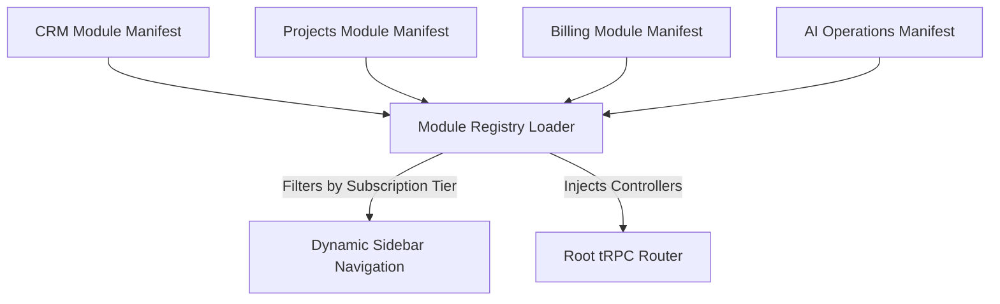
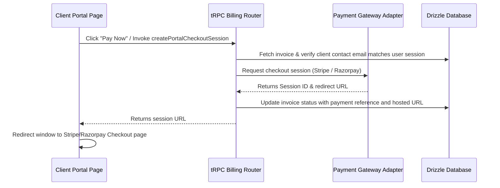
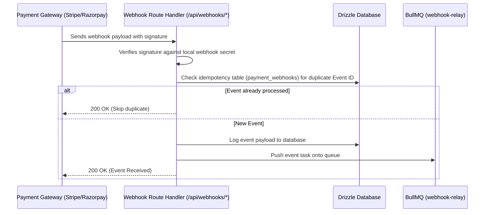

# Syncora — Unified Composable Operations OS

Syncora is a unified operations platform designed for service-oriented businesses. It integrates Client Relationship Management (CRM), Project & Task Management, Billing, Milestones, and an Automated Client Portal into a single, high-performance workspace. 

Rather than deploying complex microservices early, Syncora uses a **Modular Monolith architecture with future-ready boundaries**. Each feature exists as an independent, composable module within a Monorepo workspace that can easily be extracted into specialized network services as load scales.

---

## 1. System Architecture & Workflows

### 1.1 Composable Modular Design
At the center of Syncora is a dynamic **Module Registry**. Every domain module exposes its own routes, defines database configurations, attaches event structures, registers AI prompts, and injects navigation nodes directly into the core layout.



---

### 1.2 Checkout Session Flow (Stripe/Razorpay)
When a portal client requests a checkout session for an outstanding invoice, the payment is initiated dynamically via adapter strategies:



---

### 1.3 Webhook Reconciliation & Idempotency
Payment updates are authorized asynchronously to prevent race conditions or false payment state transitions:



---

## 2. Monorepo Directory Layout

The workspace is organized as a monorepo utilizing **pnpm workspaces** and **Turborepo** for caching build and lint pipelines:

```text
syncora/
├── apps/
│   └── web/                            # Next.js App Router (Main Frontend + Server APIs)
├── packages/
│   ├── db/                             # Drizzle ORM client, schemas, and migrations
│   ├── api/                            # tRPC routers (domain-segmented)
│   ├── ui/                             # Reusable UI component library primitives
│   ├── queue/                          # Redis-backed BullMQ client & queue definitions
│   ├── payments/                       # Stripe and Razorpay payment adapter interfaces
│   ├── ai/                             # Custom AI Gateway, RAG context retriever, and prompt library
│   ├── modules/                        # Composable Module Registry manifests
│   └── config/                         # Unified TypeScript & ESLint configurations
├── workers/                            # Long-running background BullMQ queue consumer processes
├── workflows/                          # n8n integration workflow templates
└── infrastructure/
    └── docker/                         # Local development Docker Compose services
```

---

## 3. Local Development Setup

### 3.1 Prerequisites
- **Node.js** >= 20.x
- **pnpm** >= 9.x (`npm install -g pnpm`)
- **Docker Desktop** (for PostgreSQL, Redis, and n8n)

### 3.2 Installation & Initialization

1. **Clone the repository and install workspace dependencies**:
   ```bash
   git clone https://github.com/your-org/syncora.git
   cd syncora
   pnpm install
   ```

2. **Configure Environment Keys**:
   Copy the example environment file:
   ```bash
   cp .env.example .env.local
   ```
   *Edit `.env.local` to include your Supabase Database credentials, Redis URLs, Stripe/Razorpay keys, and provider configurations.*

3. **Start local Docker infrastructure**:
   ```bash
   docker compose -f infrastructure/docker/docker-compose.dev.yml up -d
   ```
   *This initializes local PostgreSQL, Redis, and n8n automation instances.*

4. **Synchronize & Migrate Database**:
   Generate and push database schemas directly to postgres:
   ```bash
   pnpm db:migrate
   ```

5. **Start Dev Servers**:
   ```bash
   pnpm dev
   ```
   *This starts the Turborepo dev runtime pipeline. The main application is hosted at `http://localhost:3000`.*

---

## 4. Developer Quality Commands

Use the following commands inside the workspace:

- `pnpm dev` - Spins up local Next.js and worker dev environments
- `pnpm build` - Bundles and transpiles all apps and packages for production
- `pnpm typecheck` - Compiles and runs static type-checks across all workspaces
- `pnpm lint` - Validates codebase formatting and lint rules
- `pnpm db:generate` - Creates a new migration file after schema edits
- `pnpm db:studio` - Launches the local Drizzle schema browser UI
